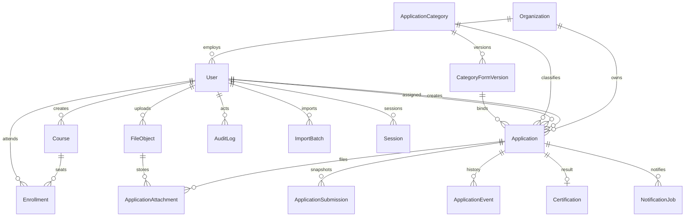

# ERD

對應 `packages/db/prisma/schema.prisma`。關聯刪除以 Restrict 為主，session 與重設 token 隨使用者刪除。

案件編號使用 PostgreSQL sequence `application_no_seq`，不採筆數加一。`source_system` 與 `source_record_key` 必須同時有值或同時為空，並有唯一限制。
